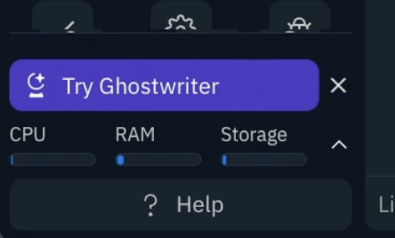
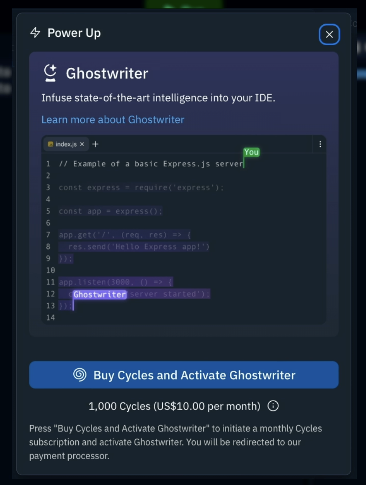
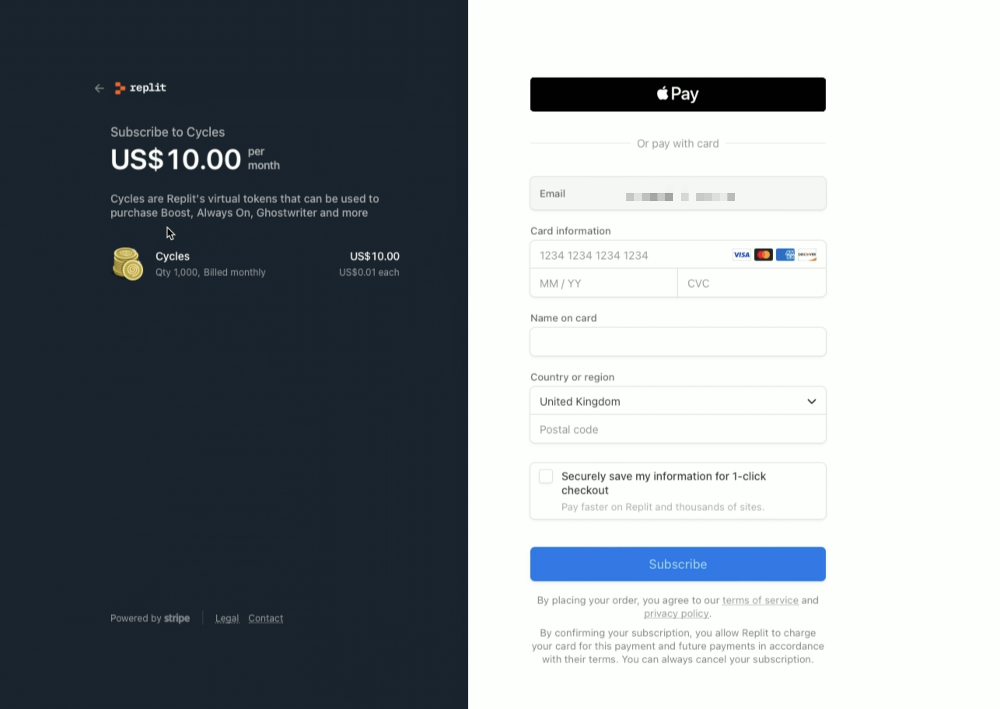
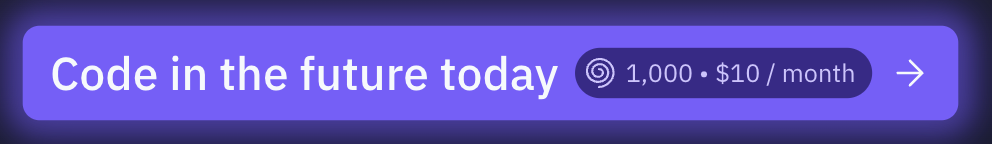

# Go Get it

Ghostwriter is a **paid** feature, the first thing we need to do is go and get it.

## In the Workspace?

Already in the workspace? Click the giant `try Ghostwriter` button at the bottom left of your side pane. 

Click the `Buy cycles and activate Ghostwriter` button.

Add your payment information.

You'll be setting up a recurring $10 a month payment to top-up your cycles and pay for Ghostwriter. You can go and change that later if you're not sure if Ghostwriter is for you, no worries. It's month-to-month, you're not committing to any long term contracts.

## Did you already dismiss that button? No worries.
Head over to [Replit](https://replit.com/ghostwriter) to purchase Ghostwriter or click on the button below to get started.

