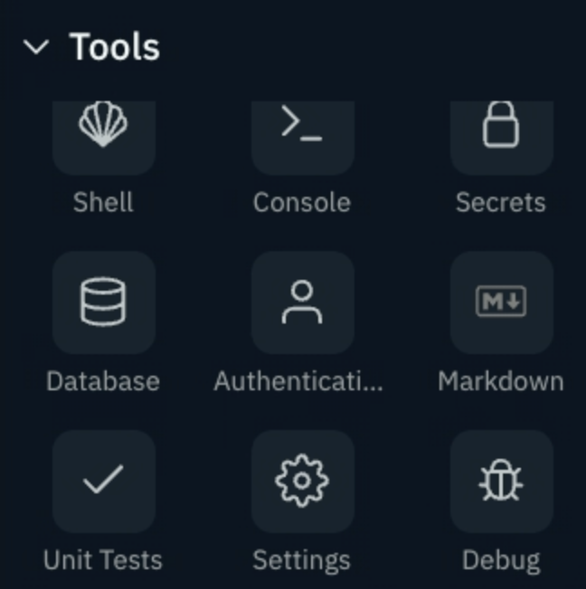
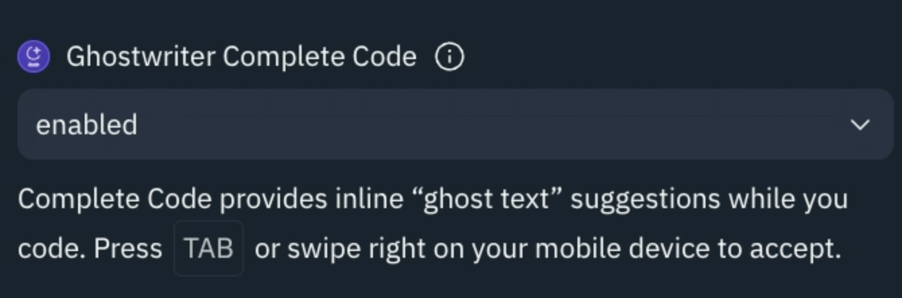

# Is it on yet?

## It should be on by default, but just in case:
Once you are inside a repl, go to your `tools` and scroll down to `settings`.

Inside settings, make sure `Ghostwriter complete code` is enabled.

*Note: There are times I turn Ghostwriter off if I am creating repls or content for learners. You can easily enable Ghostwriter to be on/off as you see fit, directly from the workspace*