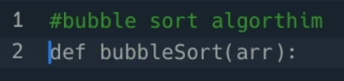
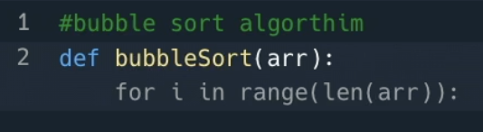
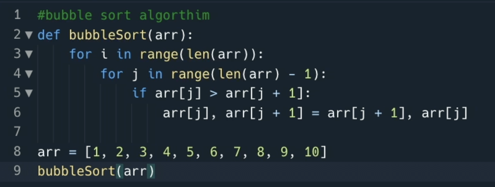
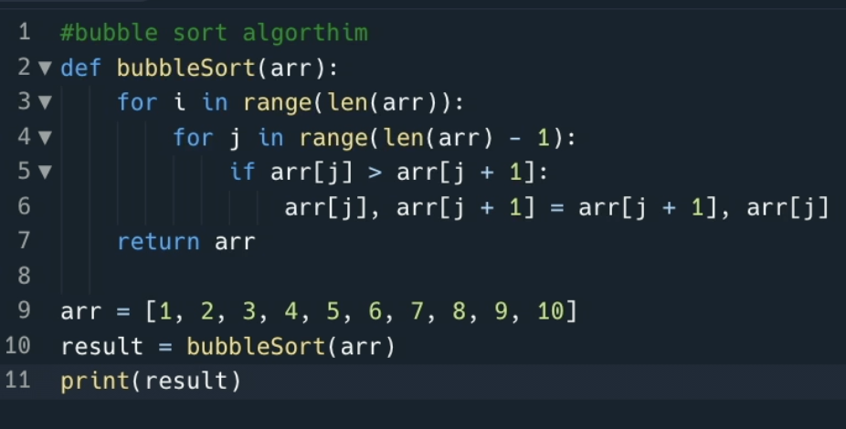

# Just Start Typing

The thing that's really going to change the way you work is that Ghostwriter is always _just there_, and suggesting the next line, or the next few lines, as you type your code. In any Repl. In a matter of minutes you'll be expecting to see it everywhere.

One of the best ways to get started with a blank code window is to give Ghostwriter a little hint of what you'll be writing.

## Comments as prompts

Let's use a classic example to get going.
In your blank repl, type the comment `#bubble sort algorithm`.

Press the `return` key to get to the next line. The second you stop writing, Ghostwriter will look at your comment and decide how best to help you. You'll see suggestions appear in grey to the righ of your current cursor position.

Press the `tab` key to accept the code. More lines of code will continue to appear after each time you press `tab`. Key accepting them with the `tab` key, or dismiss them by pressing `esc` or just start typing what you actually wanted on that line.

One comment and a bunch of tab presses can produce an entire subroutine for bubble sort! That's an impressive time saving, it even instanciated the list and called the algorithm.

## Start typing code!

If there's anything missing, or you need to make changes, just click and start editing like normal. Ghostwriter understands the full context of the file you're working in, so will make suggestions that are appropriate for what you're currently working on.

Since it's not returning anything from the subroutine I'm going to take my cursor and pop it in the location where I want to write my return statement. Before I can even press `r` Ghostwriter has suggested that I might be wanting to return the sorted array. Hey - good work Ghost-buddy!

Even as we're changing line 10 to include a variable, and adding a print to line 11 Ghostwriter is completing the lines and finishing off for us.

### Go try it out with your first comment!

_Hint: Half the fun is that you'll get suggestions that are contextual to your code. You may not get the same code as me as you go - Ghostwriter gives you suggestions that are best for you in the place in the file you're working in._