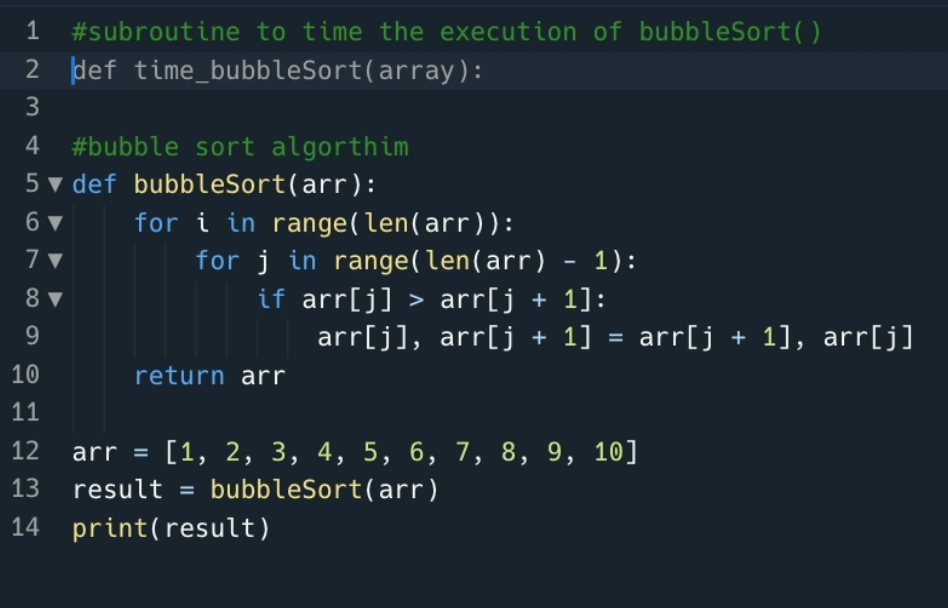
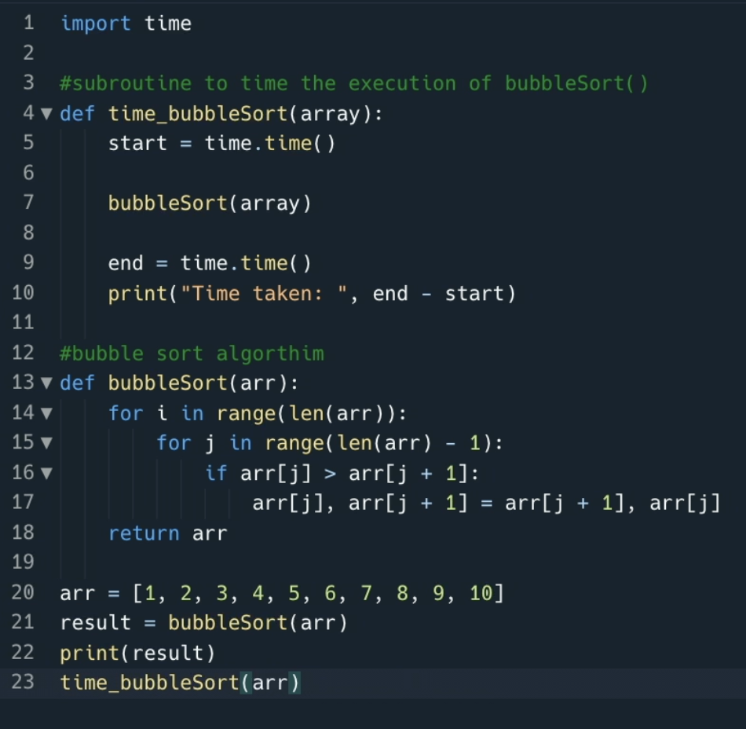
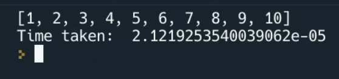

# Keep Adding to it!

We can even go back and add more code to the file. In most cases where we're looking at sorting algorithms we might also want to time how long the execution takes.

Clicking at the top of the file and making a bit of space for me to add the comment `#Subroutine to time the execution of bubbleSort()` gives Ghostwriter all the context it needs to start suggesting code for me.

After accepting line after line, and even writing the call to the function itself, Ghostwriter has pretty much done our work for us. Now if we run the code it sorts the array and tells us how long it took to compute.

This is total genius! All those times you sighed, or started hunting through your old files or even Stack Overflow because you needed to write code for something might now be a thing of the past because even if you don't know where to start you can prompt Ghostwriter with a comment!

Of couse, if you _do_ know where to start then Ghostwriter will start completing and suggesting the next lines, or chunks of code, making your experience of writing programs much quicker and more efficient.

## Go and try and add a timing function to your bubble sort algorithm too! Why not see if you can get it to display the time in milliseconds too?