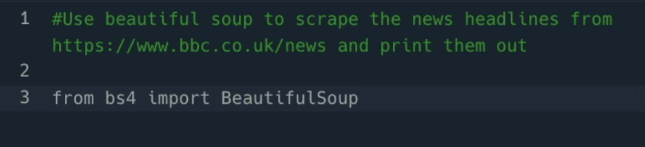
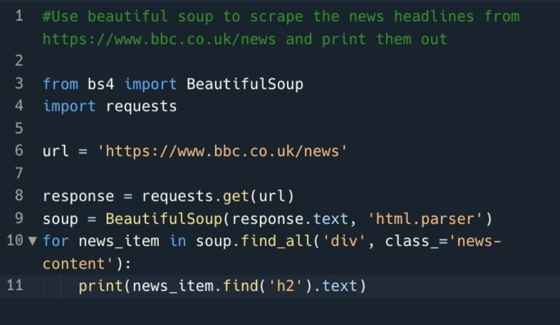
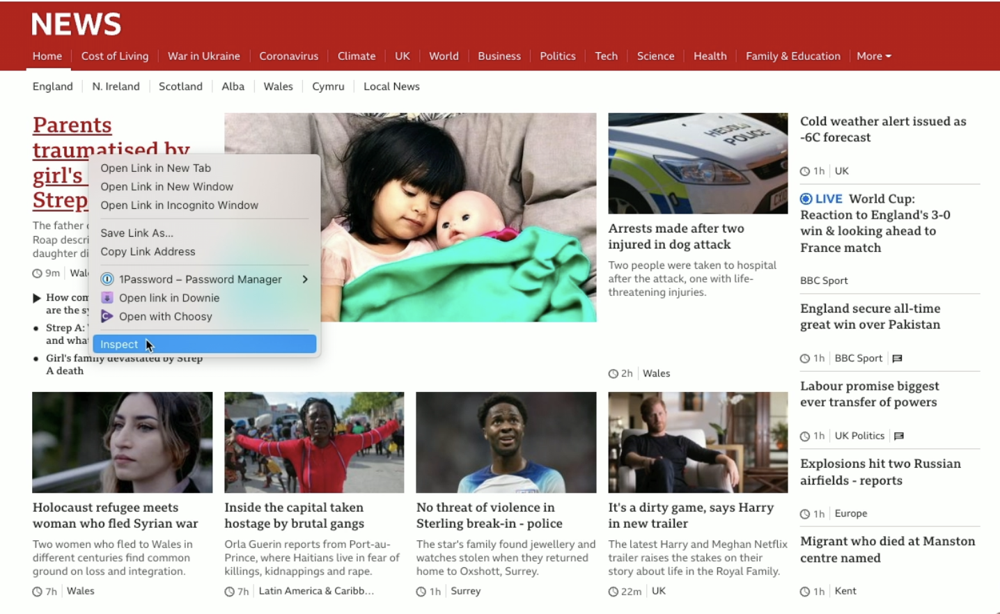
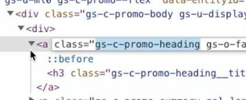
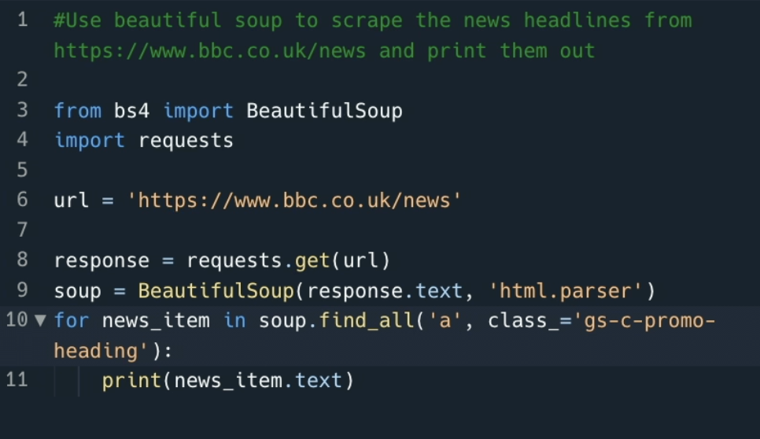
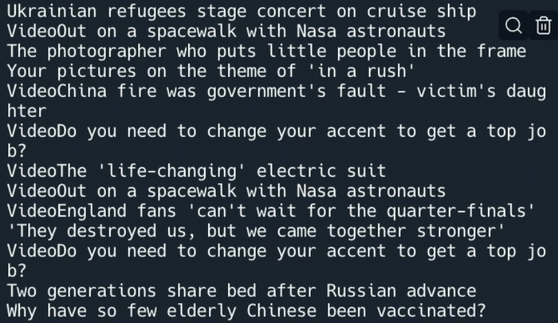

# Scrape the Web

This is something that lots of people do regularly but is often an annoyance to build. When we scrape websites we're really having to use our cognitive power to work out which bits of the website's DOM we're trying to extract, making the process of coding it a little harder as our attention is elsewhere.

Let's see if Ghostwriter can make this any better for us!

Make sure to delete any code in your `main.py` file, then add this comment to your blank Repl to scrape news from BBC news and print them out:

`#Use beautiful soup to scrape the news headlines from https://www.bbc.co.uk/news and print them out`

Ghostwriter suggests everything you need, including imports, URLs, and loops.

It's working, but it is not printing anything out. The things it's looking for on line 10 are not quite right:

# Make corrections
Head back to the url you mentioned in your first commment to Ghostwriter. Right click and choose `inspect`:

Looking at the element, we see it is actually an `<a` tag with `class="gs-c-promo-heading"` (not the `div` tag that Ghostwriter originally suggested):

Manually update the `for` loop to show the correct `<a` tag:

When you `run` the code, it is now pulling out  the main headlines. All Ghostwriter needed was a minor tweak from you: 

### See if Ghostwriter can pull in news headlines from a website of your choice with very little input from you.

#### _Why not try adjusting the comment to something like `#Use beautiful soup to scrape the news headlines from https://www.bbc.co.uk/news in <a> tags with the class name gs-c-promo-heading and print them out` the more detail you add the more context Ghostwriter has to suggest the correct thing first time_