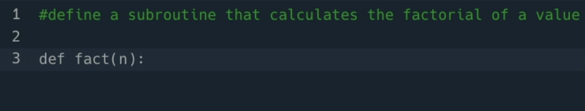
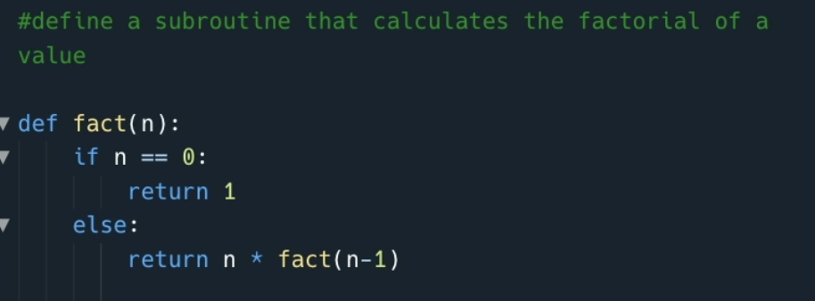
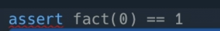
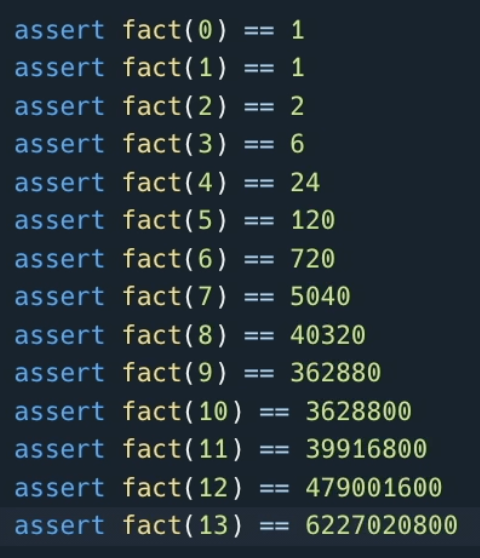

# Suggest Test Cases

It's not just me that feels a sense of dread whenever I have to write test cases is it? Unit testing is something that I know is important but something I also leave until last - which is often too late. Ghostwriter has made the process of writing unit testing a breeze, and use a lot less of my cognitive load at the same time.

Once again, clear out your `main.py` so you're got a fresh run on this, then add this comment to your Repl:

`#define a subroutine that calculate the factorial of a value`

##

Oh hey - look at this, it's generating a classic _recursive_ factorial subroutine. Great stuff!

Honestly, I can never remember this version so the fact that our spooky-pal was able to suggest it to me is something I'm eternally greatful for.

## Let's Get Testing!
Now ask Ghostwriter to create test cases:

`#construct test cases for factorial`

The way that testing works in Python is by using `assert` followed by a condition, if the condition fails then the program errors. For me, Ghostwriter _didn't_ initially suggest `asset` based tests, but I just need to prod it in the right direction.

Instead of accepting its first suggestion I just start typing `assert`, and four letters in Ghostwriter has understood the context of what I want and begins to suggest proper test cases.

##
In a matter of a few seconds, you have 14 test cases to check the algorithm works:

I also haven't had to manually work out what factorial(13) is either. Because that would be a proper faff.

### Go create your own factorial algorithm, using test cases with Ghostwriter.

#### _Why not try changing the comments up a little to see if you can get Ghostwritier to suggest `assert` based suggesstions immediately?_