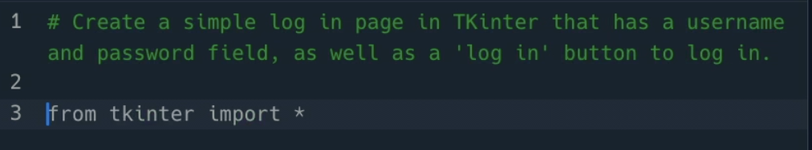
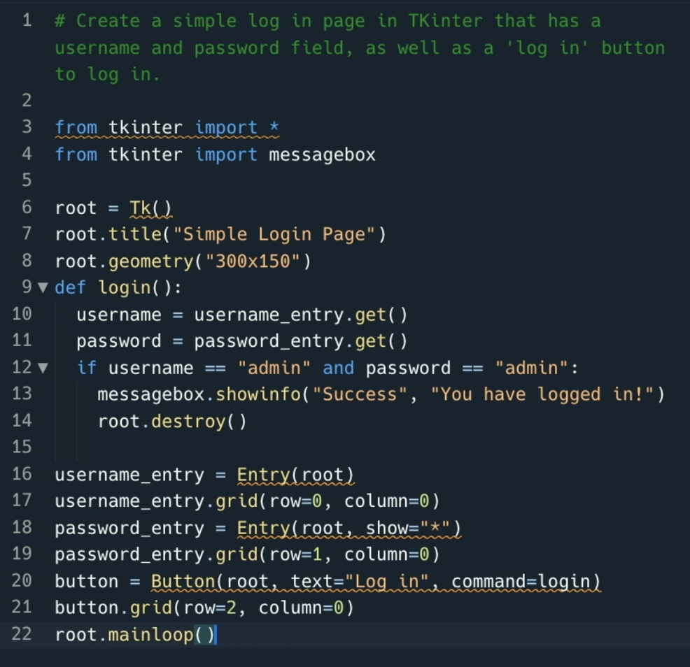
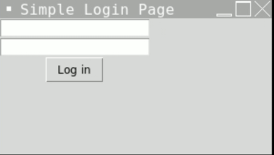
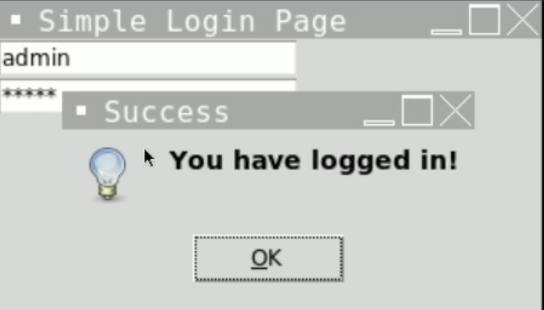

# Get your GUI on!

It's not just standard sequential programs that Ghostwriter can help with, it is trainined with a full complement of program types which means that if we want to trek into the world of GUIs and event driven programming we can, with a ghostly hand being held as we go.

Erase the other code in `main.py` and add the comment below:

`#Create a simple log in page in TKinter that has a username and password field, as well as a 'log in' button to log in.`

Yeah, I'm sorry it's TKinter. Tkinter is horrible. But this goes to show Ghostwriter's prowess, as much as I hate writing GUIs in TKinter I can now bash through it at a rate of Knots because of the suggestions it makes.

## 

Great first line suggestion, get the imports in there

Happy days! Ghostwriter created an easy login system with TKinter. It's even set a default username and password for us (although, I'm not sure what a default username and password combo of `admin` and `admin` says about the common work practice of us as a developer community…)

### What TKinter GUI can you build?

#### _Can you make it look a bit less 1990s by using ghostwriter to style it? Maybe a prompt like `style it to look like a modern web app` might help?_