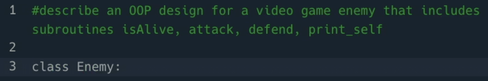
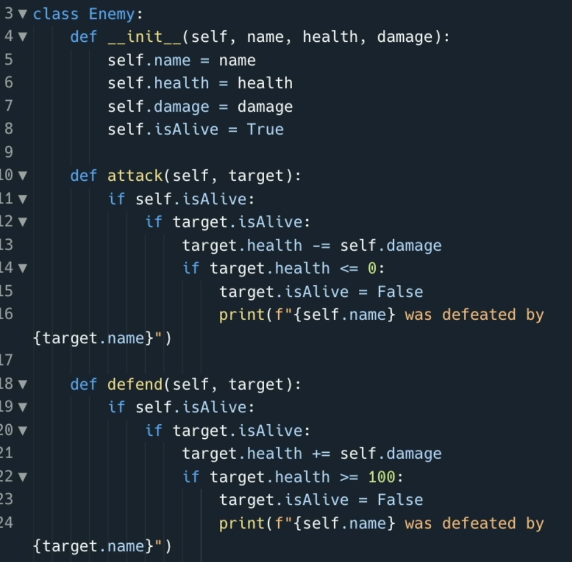
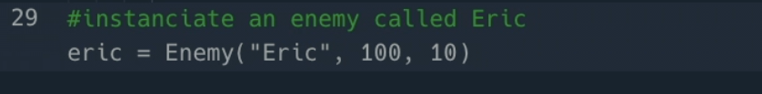
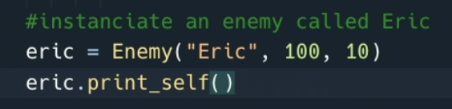
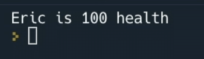

# OOPs, not oops.

Wow, that headline sounded better in my head.

Object Oriented Programming is something that we all have to do from time to time, but the initial development of the code can be a bit monotinous. No one likes having to `__inint__` every few seconds.

Why don't we see how much time and effort Ghostwritier can save you on doing something like setting out the OOP class for a video game enemy?

Clear your code and add this comment to `main.py`:

`#Describe an OOP design for a video game enemy that includes subroutines isAlive, attach, defend, print_self`

##

Well that's a good start, it's suggesting the class construct, let's see what else it can whip up.

Fantastically my prompt was so thorough that I just had to hit `tab` a couple of time and I've got this amazing code all done. It's even used f-strings to format the output nicely. Hey Ghostwriter, have you done the 100-days of code or something?!

##
We can even do proper lazy instanciation. Add this comment to instantiate an enemy:

`#instanciate an enemy called Eric`

Ghostwriter has written the initialization code, set values, created the attack system with fstrings, and given you a defend and print function.

Eric lives!

### Go and see what OOP enemy you can create with the fewest keys actually used on your keyboard.

I don't know about you, but for me I'm much more likely to build software 'the proper way' if I'm being helped this much to do the bits that are a bit more mind numbing!